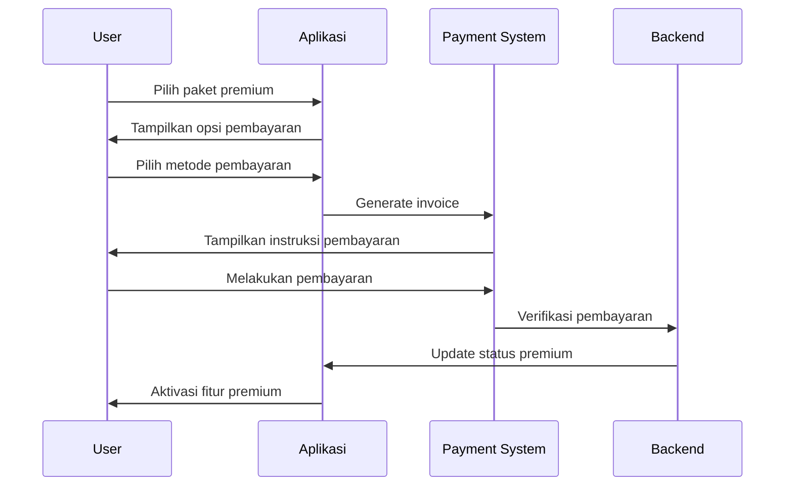
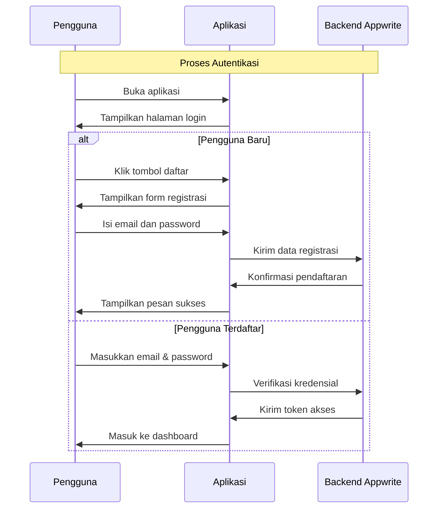
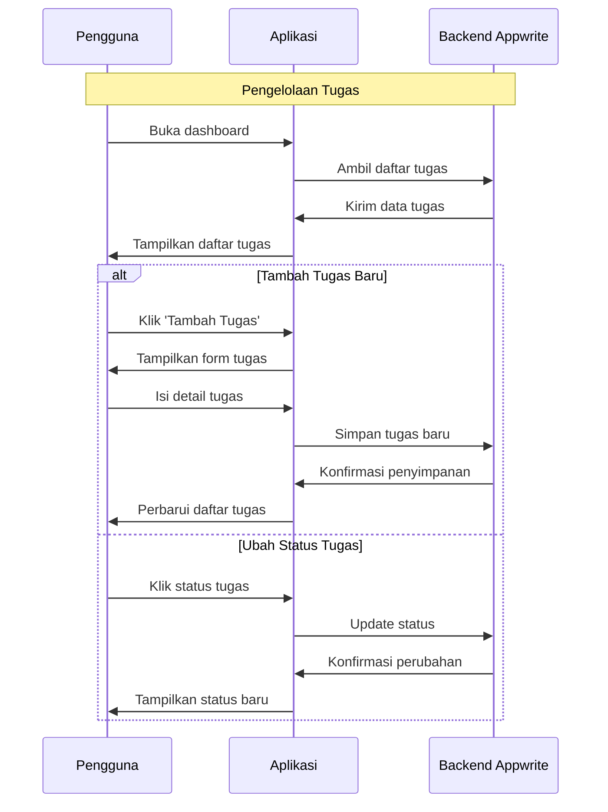
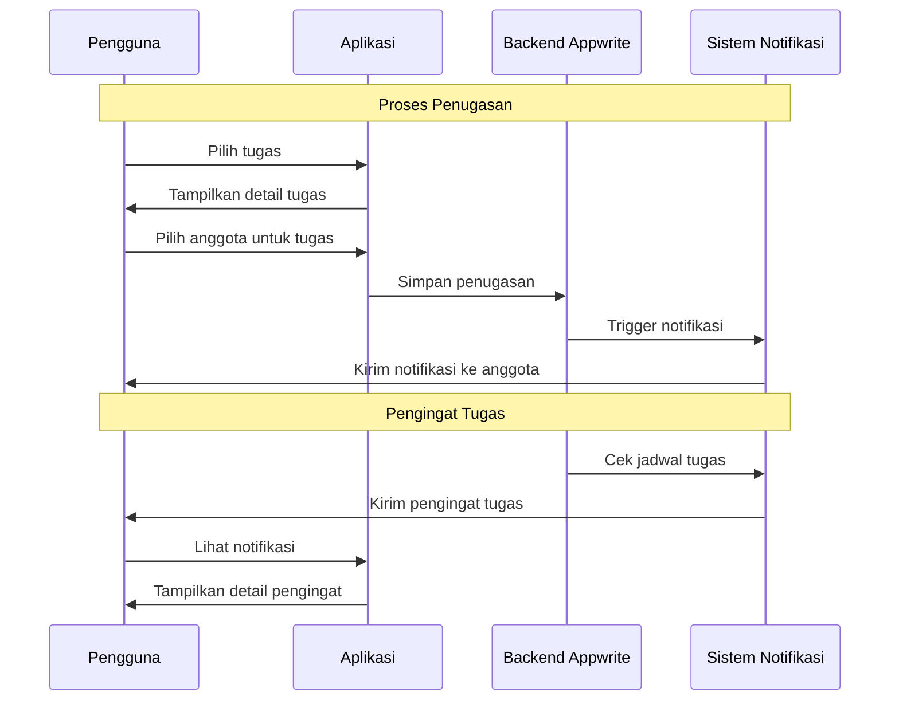
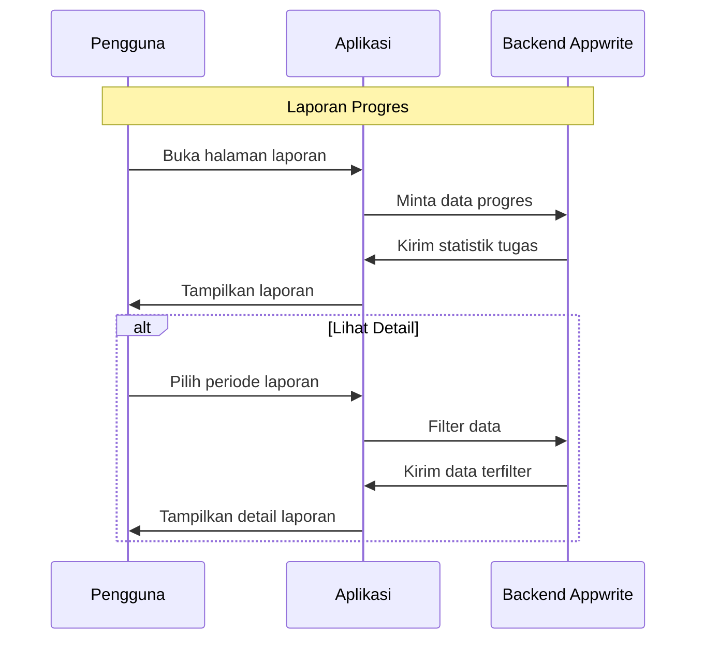

# Software Requirements Specification (SRS)
## Aplikasi: CleanHNote  
**Nama Aplikasi**: CleanHNote  
**Versi**: 1.0  
**Tanggal**: Mei 2025  
**Disusun oleh**: Bagas Rozzaq Fadli - 221240001280 

## 1. Pendahuluan

### 1.1 Tujuan Aplikasi

CleanHNote adalah aplikasi berbasis Flutter yang dirancang untuk mempermudah pengguna dalam mengelola penjadwalan dan pembagian tugas bersih-bersih. Aplikasi ini menggunakan **Appwrite** sebagai backend untuk autentikasi pengguna dan penyimpanan data. CleanHNote memungkinkan pengguna untuk membuat jadwal tugas bersih-bersih, menunjuk orang yang bertanggung jawab, dan menerima pengingat terkait tugas yang akan datang. Konsep aplikasi ini menggunakan pendekatan **multi-tenant** untuk memisahkan data antar pengguna atau kelompok yang terdaftar dalam satu project Appwrite.

#### Fitur Minimum yang Dikembangkan:
1. **Sistem Autentikasi**:
   - Login dengan email dan password
   - Registrasi pengguna baru
   - Manajemen sesi pengguna
   - Isolasi data dengan tenant_id

2. **Manajemen Tugas**:
   - Pembuatan tugas bersih-bersih
   - Penentuan jadwal dan deadline
   - Status penyelesaian tugas
   - Kategorisasi tugas (ruang tamu, kamar mandi, dll)

3. **Sistem Penugasan**:
   - Penunjukan anggota untuk tugas
   - Notifikasi penugasan
   - Pengingat tugas yang akan datang
   - Status progres tugas

4. **Antarmuka Pengguna**:
   - Dashboard informatif
   - Material Design 3
   - Responsif di berbagai ukuran layar
   - Navigasi yang intuitif

### 1.2 Cakupan Aplikasi

Aplikasi ini akan dikembangkan dalam 4 iterasi dengan fitur-fitur berikut:
- Iterasi 1: Pendaftaran dan autentikasi pengguna
- Iterasi 2: Penjadwalan dan manajemen tugas
- Iterasi 3: Penunjukan tugas dan sistem notifikasi
- Iterasi 4: Polish UI/UX dan persiapan rilis

CleanHNote akan menggunakan **satu project Appwrite** untuk semua tenant, dengan data antar tenant yang tetap terisolasi melalui penggunaan kolom **tenant_id** di setiap tabel yang ada.

### 1.3 Definisi, Akronim, dan Singkatan

- **Tenant**: Pengguna atau kelompok yang memiliki akses ke aplikasi dengan data yang terisolasi.
- **Frontend**: Antarmuka pengguna yang dibangun dengan Flutter.
- **Backend**: Sistem server yang dikelola menggunakan Appwrite untuk autentikasi, penyimpanan data, dan API.
- **Multi-Tenant**: Arsitektur database yang memungkinkan beberapa pengguna mengakses aplikasi dengan data yang terisolasi satu sama lain dalam satu project.
- **tenant_id**: ID yang digunakan untuk membedakan data pengguna berdasarkan tenant mereka di dalam satu project Appwrite.
- **Tim**: Kumpulan pengguna yang tergabung dalam satu tenant untuk mengelola tugas bersama.
- **Ketua Tim**: Pengguna yang memiliki akses untuk mengelola anggota tim dan memberikan tugas.
- **Anggota Tim**: Pengguna yang dapat menerima dan menyelesaikan tugas yang diberikan.

---

## 2. Deskripsi Umum

### 2.1 Perspektif Sistem

CleanHNote akan dikembangkan dengan pendekatan iteratif:
- **Iterasi 1 - Frontend (Flutter)**: Setup awal dan sistem autentikasi
- **Iterasi 1 - Backend (Appwrite)**: Konfigurasi Appwrite dan manajemen pengguna
- **Iterasi 2**: Implementasi dashboard dan manajemen tugas
- **Iterasi 3**: Sistem penugasan dan notifikasi
- **Iterasi 4**: Polish akhir dan persiapan rilis

### 2.2 Fitur Utama (Berdasarkan Iterasi)

1. **Iterasi 1 - Pendaftaran dan Autentikasi**:
   - Pendaftaran dengan email dan password
   - Login dan manajemen sesi
   - Integrasi Appwrite SDK
   
2. **Iterasi 2 - Dashboard dan Manajemen Tugas**:
   - Dashboard interaktif
   - CRUD tugas bersih-bersih
   - Status dan tracking tugas

3. **Iterasi 3 - Penugasan dan Notifikasi**:
   - Sistem penunjukan anggota
   - Notifikasi real-time
   - Pengingat tugas

4. **Iterasi 4 - Polish dan Finalisasi**:
   - UI/UX Material Design 3
   - Pengujian menyeluruh
   - Optimasi performa

---

## 3. Kebutuhan Sistem

### 3.1 Kebutuhan Perangkat Lunak (Per Iterasi)

**Iterasi 1**:
- Flutter SDK
- Appwrite SDK untuk Flutter
- Dart Programming Language

**Iterasi 2**:
- State Management Solution
- Local Storage

**Iterasi 3**:
- Firebase Cloud Messaging
- Background Services

**Iterasi 4**:
- Testing Framework
- UI Component Library

### 3.2 Kebutuhan Perangkat Keras

- **Frontend**: Smartphone dengan Android/iOS.
- **Backend**: Server dengan kapasitas penyimpanan yang cukup untuk mendukung operasi aplikasi multi-tenant.

---

## 4. Fitur dan Deskripsi (Berdasarkan Iterasi)

### 4.1 Iterasi 1 - Sistem Autentikasi
- **Fungsi**: Setup proyek dan autentikasi dasar
- **Proses**:
  - Konfigurasi Flutter dan Appwrite
  - Implementasi login/register
  - Manajemen tenant_id

### 4.2 Iterasi 2 - Manajemen Tugas
- **Fungsi**: Dashboard dan CRUD tugas
- **Proses**:
  - Implementasi dashboard
  - Manajemen tugas
  - Status tracking

### 4.3 Iterasi 3 - Penugasan dan Notifikasi
- **Fungsi**: Sistem penugasan dan pengingat
- **Proses**:
  - Penunjukan anggota
  - Setup notifikasi
  - Pengingat otomatis

### 4.4 Iterasi 4 - Finalisasi
- **Fungsi**: Polish dan persiapan rilis
- **Proses**:
  - UI/UX polish
  - Testing
  - Optimasi

### 4.5 Penunjukan Tugas

- **Fungsi**: Pengguna dapat menunjuk siapa yang bertanggung jawab untuk setiap tugas.
- **Proses**:
  - Pengguna memilih anggota tim yang akan bertanggung jawab atas tugas bersih-bersih.

### 4.6 Manajemen Tim (Tambahan)
- **Fungsi**: Pengelolaan anggota tim dalam sistem.
- **Proses**:
  1. **Pembuatan Tim**:
     - Ketua tim mendaftar sebagai pengguna baru
     - Sistem membuat tenant_id baru untuk tim tersebut
     - Ketua tim mendapatkan kode undangan tim

  2. **Penambahan Anggota**:
     - Ketua tim membagikan kode undangan kepada calon anggota
     - Calon anggota mendaftar/login dengan kode undangan
     - Sistem otomatis menambahkan pengguna ke tim yang sesuai

  3. **Peran dan Hak Akses**:
     - Ketua Tim:
       * Mengelola anggota tim (tambah/hapus)
       * Membuat dan menugaskan tugas
       * Melihat laporan semua anggota
       * Mengatur pengingat tugas
     
     - Anggota Tim:
       * Melihat tugas yang ditugaskan
       * Mengupdate status tugas
       * Menerima notifikasi tugas
       * Melihat laporan pribadi

  4. **Struktur Data Tim**:
     ```json
     {
       "teams": {
         "tenant_id": "string",
         "team_name": "string",
         "leader_id": "string",
         "invitation_code": "string",
         "created_at": "timestamp"
       },
       "team_members": {
         "user_id": "string",
         "tenant_id": "string",
         "role": "leader|member",
         "joined_at": "timestamp"
       }
     }
     ```

### 4.7 Alur Kerja Tim

1. **Pembentukan Tim**:
   - Pengguna mendaftar sebagai ketua tim
   - Sistem generate kode undangan unik
   - Ketua tim mengundang anggota

2. **Pengelolaan Anggota**:
   - Anggota bergabung menggunakan kode undangan
   - Ketua tim dapat mengelola keanggotaan
   - Sistem mencatat history keanggotaan

3. **Penugasan**:
   - Ketua tim membuat tugas baru
   - Memilih anggota dari daftar tim
   - Sistem mengirim notifikasi ke anggota
   - Anggota menerima dan mengerjakan tugas

4. **Monitoring**:
   - Ketua tim memantau progress
   - Anggota melaporkan penyelesaian
   - Sistem mencatat semua aktivitas

### 4.8 Antarmuka Tim

1. **Halaman Tim**:
   - Daftar anggota tim
   - Status keaktifan anggota
   - Statistik kinerja tim
   - Kode undangan tim

2. **Panel Ketua Tim**:
   - Manajemen anggota
   - Overview tugas tim
   - Laporan kinerja tim
   - Pengaturan tim

3. **Panel Anggota**:
   - Daftar tugas personal
   - Status tugas aktif
   - Riwayat tugas
   - Notifikasi

### 4.9 Fitur Premium

#### 4.9.1 Deskripsi Fitur Premium
Fitur premium dirancang untuk memberikan pengalaman yang lebih lengkap bagi pengguna yang membutuhkan fitur tambahan untuk manajemen kebersihan tim mereka.

#### 4.9.2 Paket Premium
1. **Bulanan**:
   - Harga: Rp 49.000/bulan
   - Akses semua fitur premium
   - Auto-renewal optional

2. **Tahunan**:
   - Harga: Rp 499.000/tahun
   - Diskon 15%
   - Akses semua fitur premium
   - Auto-renewal optional

#### 4.9.3 Fitur Premium vs Free
1. **Free Plan**:
   - Tugas personal dasar
   - Manajemen tugas pribadi
   - Notifikasi dasar
   - Tidak bisa membuat tim
   - Tidak bisa upload foto
   - Laporan terbatas

2. **Premium Plan**:
   - **Fitur Tim**:
     * Buat tim
     * Undang hingga 50 anggota per tim
     * Manajemen tim lengkap
     * Kolaborasi real-time
   
   - **Dokumentasi Foto**:
     * Upload foto before-after
     * Kompres foto otomatis
   
   - **Laporan Premium**:
     * Export PDF
     * Statistik detail
     * Grafik progress
     * Analisis tim

#### 4.9.4 Sistem Pembayaran
1. **Metode Pembayaran**:
   - Transfer Bank
   - E-wallet (DANA, OVO, GoPay)
   - Qris
   - Virtual Account
   - Credit Card

2. **Proses Pembayaran**:
   - User memilih paket premium
   - Memilih metode pembayaran
   - Sistem generate invoice
   - User melakukan pembayaran
   - Upload bukti pembayaran (jika transfer manual)
   - Admin verifikasi pembayaran
   - Akun diupgrade ke premium
   - Notifikasi sukses dikirim

#### 4.9.5 Struktur Data Premium

```json
{
    "subscriptions": {
        "user_id": "string",
        "plan_type": "free|premium",
        "plan_duration": "monthly|yearly",
        "start_date": "timestamp",
        "end_date": "timestamp",
        "payment_status": "active|expired|cancelled",
        "auto_renewal": "boolean"
    },
    "payments": {
        "user_id": "string",
        "subscription_id": "string",
        "amount": "number",
        "payment_method": "string",
        "payment_status": "pending|success|failed",
        "transaction_id": "string",
        "payment_proof": "string (URL)"
    },
    "cleaning_photos": {
        "task_id": "string",
        "user_id": "string",
        "team_id": "string",
        "photo_url": "string",
        "photo_type": "before|after",
        "location_data": {
            "latitude": "number",
            "longitude": "number",
            "address": "string"
        }
    }
}
```

#### 4.9.6 Alur Upgrade ke Premium


---

## 5. Arsitektur Sistem

### 5.1 Arsitektur Frontend & Backend

Aplikasi akan dibangun sepenuhnya menggunakan **Flutter** dengan pendekatan **Clean Architecture**, yang memungkinkan aplikasi berjalan di platform Android dan iOS. Antarmuka pengguna (UI) akan menggunakan **Material Design 3** untuk konsistensi dan pengalaman pengguna yang modern.

Untuk backend services, aplikasi akan memanfaatkan **Appwrite SDK untuk Flutter** secara langsung, yang menyediakan:
- Autentikasi pengguna
- Database management
- Storage
- Realtime subscriptions
- Cloud Functions (menggunakan Dart)

### 5.2 Arsitektur Database

Aplikasi ini menggunakan **multi-tenant database**. Setiap pengguna akan memiliki akses ke data yang terisolasi dengan **tenant_id** di setiap tabel. Struktur database dasar adalah sebagai berikut:

- **Users**: Menyimpan data pengguna, termasuk nama, email, password, tenant_id.
- **Tasks**: Menyimpan tugas bersih-bersih, tanggal, deskripsi, status, tenant_id.
- **Schedules**: Menyimpan informasi tentang waktu dan tugas yang dijadwalkan, tenant_id.
- **Assignments**: Menyimpan data penugasan tugas kepada anggota tim, tenant_id.

### 5.4 Alur Data

1. **Autentikasi Pengguna**: Pengguna login melalui Flutter UI, data diproses menggunakan Appwrite SDK.
2. **Penjadwalan Tugas**: Setelah login, pengguna membuat tugas yang tersimpan di Appwrite dengan tenant_id menggunakan Appwrite SDK.
3. **Pengingat**: Notifikasi pengingat dikirim menggunakan **Firebase Cloud Messaging**.
4. **Laporan Progres**: Data tugas diambil dari Appwrite database menggunakan SDK dan ditampilkan di UI.

---

## 6. Batasan dan Asumsi

- **Batasan**: 
  - Hanya fitur dasar yang tersedia dalam iterasi ini (penjadwalan, penugasan, notifikasi).
  - Aplikasi hanya tersedia untuk platform Android dan iOS.
  
- **Asumsi**: 
  - Pengguna sudah memiliki akses ke perangkat yang dapat menjalankan aplikasi Flutter.
  - Backend dapat menangani beban yang diperlukan untuk aplikasi multi-tenant.

---

## 7. Alur Pengguna

Berikut adalah alur penggunaan aplikasi CleanHNote berdasarkan setiap iterasi pengembangan:

### 7.1 Alur Autentikasi Pengguna


### 7.2 Alur Manajemen Tugas


### 7.3 Alur Penugasan


### 7.4 Alur Pelaporan


### Penjelasan Alur:

1. **Proses Autentikasi**:
   - Pengguna baru dapat mendaftar dengan email dan password
   - Pengguna terdaftar bisa langsung login
   - Setelah login berhasil, pengguna diarahkan ke dashboard

2. **Pengelolaan Tugas**:
   - Pengguna dapat melihat semua tugas di dashboard
   - Bisa menambah tugas baru dengan mengisi form
   - Dapat mengubah status tugas (selesai/belum)
   - Setiap perubahan langsung diperbarui di database

3. **Sistem Penugasan**:
   - Pengguna bisa memilih anggota untuk tugas
   - Sistem mengirim notifikasi ke anggota terpilih
   - Pengingat otomatis dikirim sesuai jadwal
   - Anggota dapat melihat dan merespon tugas

4. **Pelaporan Progres**:
   - Pengguna dapat melihat statistik tugas
   - Bisa memfilter laporan berdasarkan periode
   - Melihat detail progres setiap tugas
   - Mengakses riwayat penyelesaian tugas

Setiap alur dirancang untuk memberikan pengalaman pengguna yang mudah dan intuitif, dengan fokus pada efisiensi dan kemudahan penggunaan aplikasi.

---
