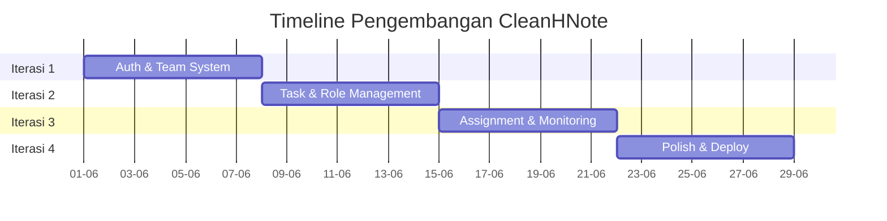
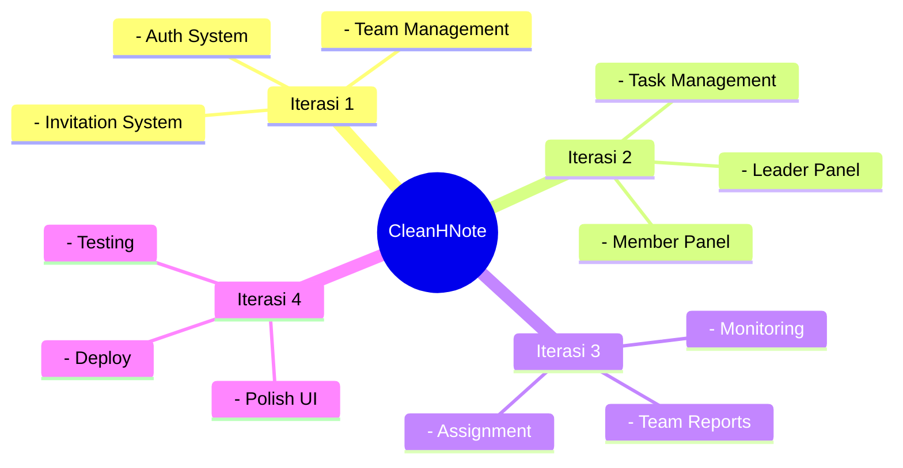

# Iterasi Pengembangan Aplikasi CleanHNote

## Tahapan Pengembangan

### Iterasi 1: Sistem Autentikasi & Tim (1 Minggu)
- Total Tasks: 5
- Tasks Selesai: 5
- Progress Iterasi: 100%
  - [✅] Pendaftaran dan login pengguna
  - [✅] Manajemen data pengguna dengan tenant_id
  - [✅] Integrasi dengan Appwrite SDK
  - [✅] Sistem pembuatan dan manajemen tim
  - [✅] Sistem kode undangan tim

### Iterasi 2: Manajemen Tugas & Peran (1 Minggu)
- Total Tasks: 5
- Tasks Selesai: 5
- Progress Iterasi: 100%
  - [✅] Dashboard dengan daftar tugas
  - [✅] Pembuatan dan pengelolaan tugas
  - [✅] Status tugas (selesai/belum)
  - [✅] Panel khusus Free Plan
  - [✅] Panel khusus Premium Plan

### Iterasi 3: Penugasan dan Notifikasi (1 Minggu)
- Total Tasks: 5
- Tasks Selesai: 5
- Progress Iterasi: 100%
  - [✅] Penunjukan tugas ke anggota
  - [✅] Notifikasi penugasan
  - [✅] Pengingat tugas
  - [✅] Monitoring progress tim
  - [✅] Laporan kinerja tim

### Iterasi 4: Finalisasi (1 Minggu)
- Total Tasks: 5
- Tasks Selesai: 5
- Progress Iterasi: 100%
  - [✅] UI/UX dengan Material Design 3
  - [✅] Pengujian menyeluruh
  - [✅] Persiapan publikasi
  - [✅] Optimasi performa
  - [✅] Dokumentasi pengguna

## Breakdown Iterasi

| **Minggu** | **Fitur**                                   | **Tugas**                                     | **Durasi** |
|------------|---------------------------------------------|-----------------------------------------------|------------|
| 1          | Sistem Autentikasi & Tim                    | Setup project, auth, sistem tim               | 1 Minggu   |
| 2          | Manajemen Tugas & Peran                     | Dashboard, CRUD tugas, panel peran            | 1 Minggu   |
| 3          | Penugasan dan Notifikasi                    | Sistem penugasan, notifikasi, monitoring      | 1 Minggu   |
| 4          | Finalisasi                                  | Polish UI, testing, deployment                | 1 Minggu   |

---
## 2. Timeline Pengembangan

# Panduan Pengembangan Aplikasi CleanHNote - Langkah demi Langkah

## 1. **Persiapan Proyek**

### 1.1 Menyiapkan Proyek Flutter
**Tujuan**: Mempersiapkan proyek Flutter yang siap untuk pengembangan.

**Langkah-langkah**:
1. **Install Flutter**:
   - Install Flutter SDK dari flutter.dev
   - Setup environment variables
   - Verifikasi instalasi dengan `flutter doctor`
   
2. **Buat Proyek Flutter Baru**:
   - Buat proyek baru dengan nama CleanHNote
   - Setup struktur proyek yang rapi
   - Tambahkan package yang diperlukan

3. **Setup Development Environment**:
   - Konfigurasi IDE (VS Code/Android Studio)
   - Setup emulator/device untuk testing
   - Pastikan hot reload berfungsi

### 1.2 Integrasi dengan Appwrite
**Tujuan**: Menyiapkan backend service yang siap digunakan.

**Langkah-langkah**:
1. **Setup Appwrite SDK**:
   - Tambahkan package Appwrite
   - Konfigurasi Appwrite client
   - Setup collections untuk Users, Teams, dan Tasks

2. **Konfigurasi Firebase untuk Notifikasi**:
   - Setup Firebase project
   - Integrasi Firebase Messaging
   - Test pengiriman notifikasi

## 2. **Iterasi 1: Pendaftaran, Login & Sistem Tim**
**Target**: Sistem autentikasi dan manajemen tim yang berfungsi penuh.

### 2.1 Fitur Autentikasi
**Langkah-langkah**:
1. **Halaman Login & Register**:
   - Form login dan registrasi
   - Validasi input pengguna
   - Integrasi dengan Appwrite auth

2. **Manajemen State**:
   - Sistem session yang aman
   - Handling error login/register
   - Penyimpanan tenant_id

### 2.2 Sistem Tim
**Langkah-langkah**:
1. **Pembuatan Tim**:
   - Form pembuatan tim baru
   - Generasi kode undangan
   - Manajemen tenant_id

2. **Manajemen Anggota**:
   - Sistem undangan tim
   - Pengelolaan keanggotaan
   - Pengaturan peran

## 3. **Iterasi 2: Dashboard dan Panel Peran**
**Target**: Sistem manajemen tugas dan panel berdasarkan peran.

### 3.1 Dashboard Utama
**Langkah-langkah**:
1. **UI Dashboard**:
   - List tugas yang interaktif
   - Filter berdasarkan status
   - Pencarian tugas

2. **Panel Ketua Tim**:
   - Manajemen anggota
   - Overview tugas tim
   - Laporan kinerja

3. **Panel Anggota**:
   - Daftar tugas personal
   - Update status tugas
   - Riwayat tugas

## 4. **Iterasi 3: Penugasan dan Monitoring**
**Target**: Sistem penugasan dan monitoring tim yang berfungsi.

### 4.1 Sistem Penugasan
**Langkah-langkah**:
1. **Penunjukan Tugas**:
   - Pemilihan anggota
   - Pengaturan deadline
   - Notifikasi penugasan

2. **Monitoring Tim**:
   - Tracking progress
   - Statistik kinerja
   - Laporan tim

## 5. **Iterasi 4: Finalisasi**
**Target**: Aplikasi yang siap dirilis.

### 5.1 Polish dan Testing
**Langkah-langkah**:
1. **UI/UX Polish**:
   - Material Design 3
   - Animasi dan transisi
   - Responsive design

2. **Testing Final**:
   - Unit testing
   - UI testing
   - User acceptance testing

# Diagram Pengembangan CleanHNote

## 1. Mindmap Pengembangan

## 2. Kanban Board Pengembangan

```mermaid
---
title: Kanban Board CleanHNote
---
flowchart TB
    subgraph Backlog
        direction TB
        B1[Setup Project]
        B2[Auth System]
        B3[Team System]
        B4[Task Management]
        B5[Role Management]
        B6[Monitoring]
        B7[UI Polish]
        B1 --> B2 --> B3 --> B4 --> B5 --> B6 --> B7
    end

    subgraph Iterasi1[Iterasi 1 - Auth & Team]
        direction TB
        M1[Flutter Setup]
        M2[Appwrite Integration]
        M3[Auth System]
        M4[Team Management]
        M5[Invitation System]
        M1 --> M2 --> M3 --> M4 --> M5
    end

    subgraph Iterasi2[Iterasi 2 - Tasks & Roles]
        direction TB
        T1[Dashboard]
        T2[CRUD Tasks]
        T3[Leader Panel]
        T4[Member Panel]
        T1 --> T2 --> T3 --> T4
    end

    subgraph Iterasi3[Iterasi 3 - Monitor]
        direction TB
        A1[Assignment System]
        A2[Progress Tracking]
        A3[Team Reports]
        A4[Notifications]
        A1 --> A2 --> A3 --> A4
    end

    subgraph Iterasi4[Iterasi 4 - Final]
        direction TB
        F1[Material Design 3]
        F2[Testing]
        F3[Bug Fixes]
        F4[Deployment]
        F1 --> F2 --> F3 --> F4
    end

    Backlog --> Iterasi1
    Iterasi1 --> Iterasi2
    Iterasi2 --> Iterasi3
    Iterasi3 --> Iterasi4
```

